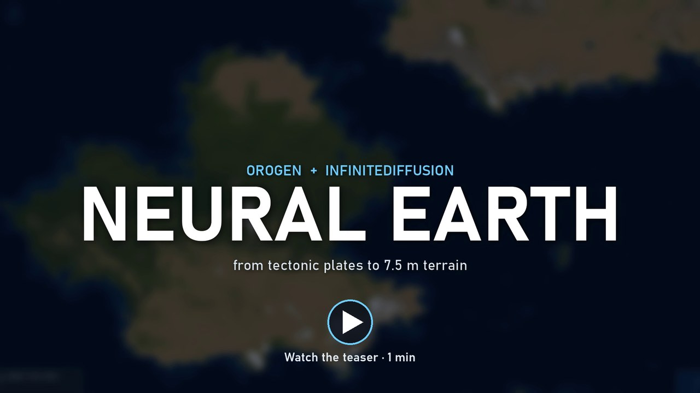
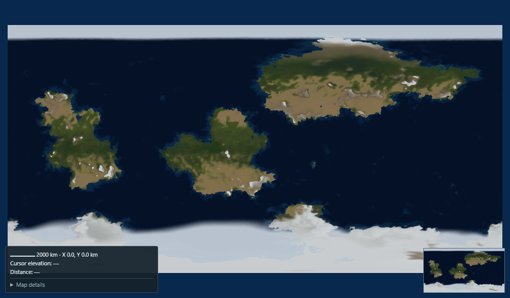
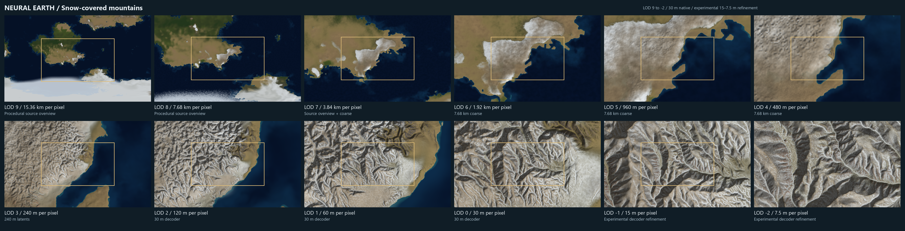
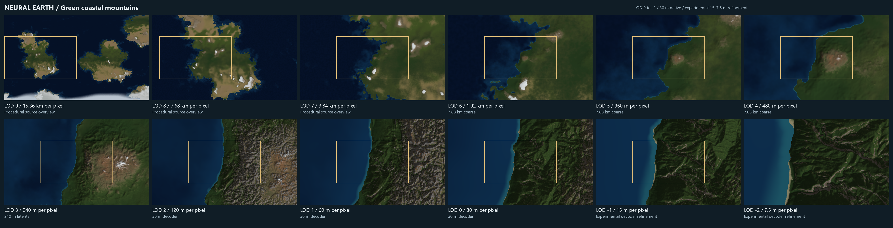
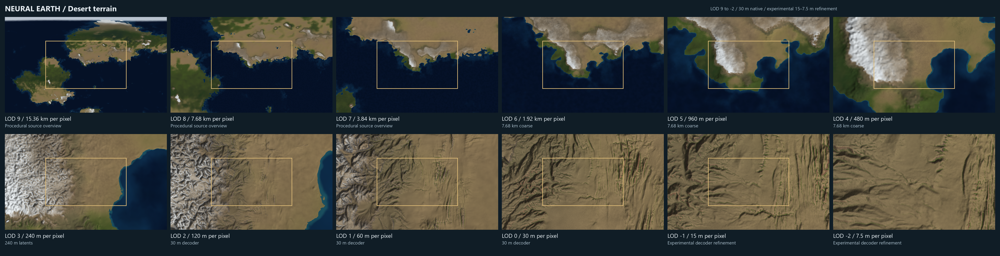
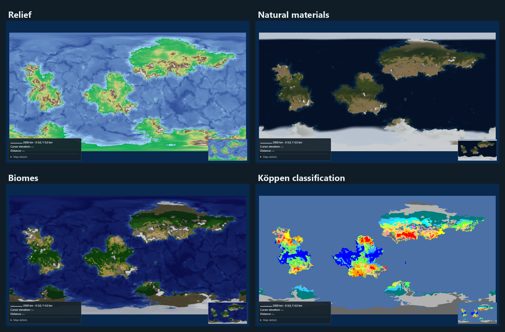
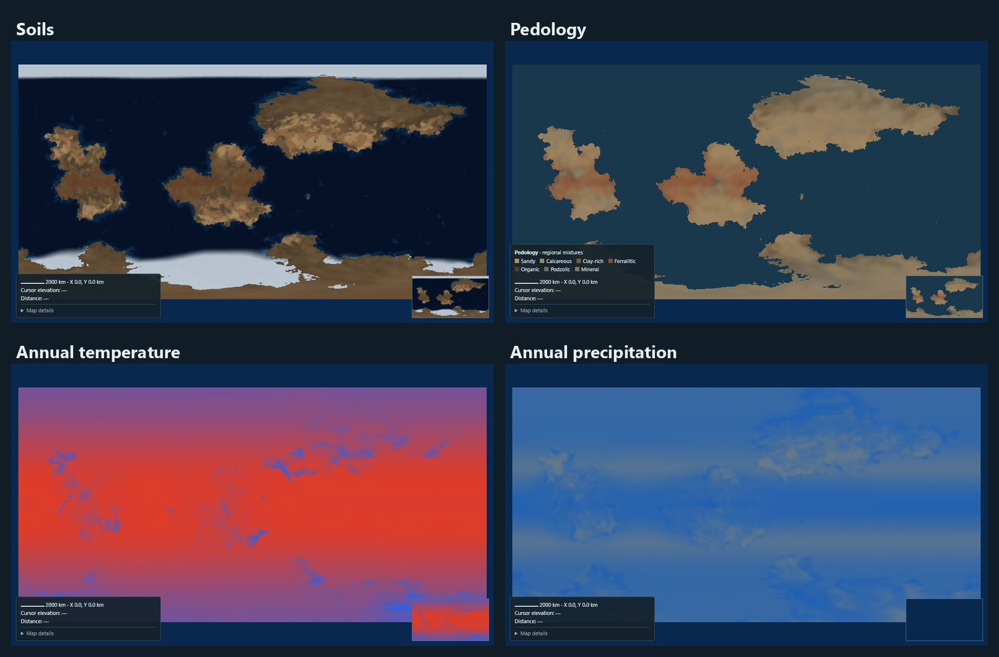
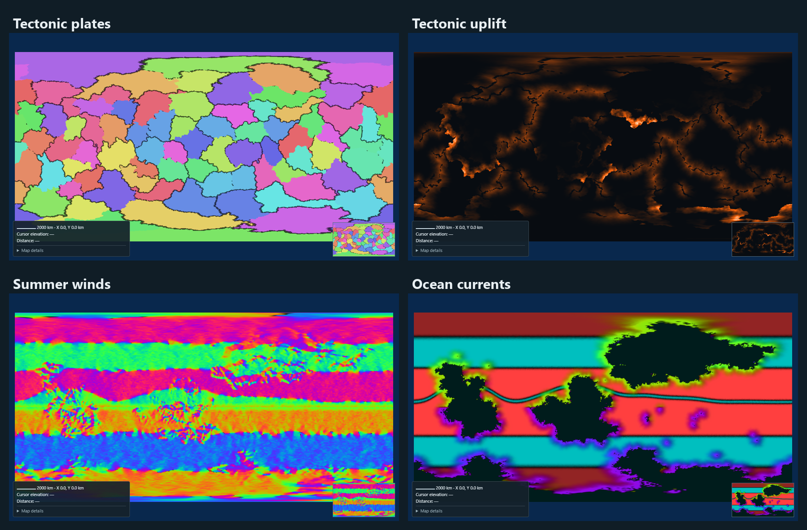
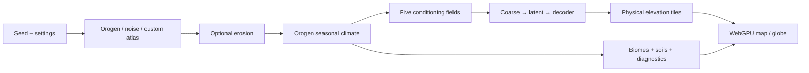

# Neural Earth

**Procedural worlds, from tectonic plates to neural terrain.**

[](docs/videos/neural-earth-teaser.mp4)

**[Watch the 1-minute teaser](docs/videos/neural-earth-teaser.mp4)**: World Orogen, InfiniteDiffusion, then live Neural Earth navigation from world view to 7.5 m terrain. Loading times are accelerated, and on-screen badges show each speed-up. The project is open source and looking for contributors.

Neural Earth builds on **[World Orogen](https://github.com/raguilar011095/planet_heightmap_generation)** ([project](https://orogen.studio/)) and **[InfiniteDiffusion / Terrain Diffusion](https://github.com/xandergos/terrain-diffusion)** ([scientific paper](https://arxiv.org/abs/2512.08309), [project](https://xandergos.github.io/terrain-diffusion/)). We combine their planetary generation and learned refinement into a complete procedural world workflow: continents, tectonic relief, erosion, seasonal climate, biomes, soils, and continuous exploration in a map or globe.

The long-term goal is to integrate **MagnaUrbis** ([GitHub](https://github.com/dunkean/magna-urbis), [website](https://dunkean.github.io/magna-urbis/)) for procedural roads, settlements and cities, extending the geographic world into a populated world. This integration is planned. The project is currently hosted as [burgmap](https://github.com/dunkean/burgmap); the `magna-urbis` repository and website links anticipate its upcoming rename.

Orogen's erosion methods draw on [stream-power incision](https://doi.org/10.1016/j.geomorph.2012.10.008) and [Priority-Flood drainage](https://doi.org/10.1016/j.cageo.2013.04.024). These are scientific method references, rather than a dedicated Orogen paper.



## From planetary scale to local terrain

Actual application captures follow three locations from **LOD 9 to LOD -2**. Read each two-row sheet left to right: **9, 8, 7, 6, 5, 4** on the first row, then **3, 2, 1, 0, -1, -2** on the second. The first row moves quickly from the planetary overview to regional relief; every fine view is captured only after its requested tiles have finished loading.

LOD 0 reaches the checkpoint's **30 m native terrain resolution**. LOD -1 and -2 show **experimental sub-30 m refinement**, sampled at 15 m and 7.5 m; these are not independently trained higher-resolution terrain. Click a sheet to open its full-size version.

**Snow-covered mountains**

[](docs/images/zoom-snow.png)

**Green mountains meeting the sea**

[](docs/images/zoom-coast.png)

**Desert terrain**

[](docs/images/zoom-desert.png)

Full-size captures, seeds, coordinates, settings and source resolutions are recorded in the [screenshot manifest](docs/images/screenshots.json).

## Read the world through its layers







The menu also includes seasonal climate, crust types, plate boundaries, convergence, hotspots, rain shadows, atmospheric pressure and cartographic styles. [Layer guide](docs/layers.md).

## Install and run

This is a **local Linux/Windows Python application**. Neural inference requires an **NVIDIA GPU with CUDA and BF16 support**. A **24 GB GPU such as the RTX 3090** is the tested reference for comfortable exploration; smaller cards have no certified minimum configuration. Browser WebGPU accelerates rendering; the neural networks run on the Python server. PNG fallback still needs CUDA.

Install Python 3.12, Node.js 20+ and an NVIDIA driver compatible with the locked CUDA 12.8 build:

Linux:

```bash
git clone --recurse-submodules https://github.com/dunkean/neural-earth.git
cd neural-earth
python3.12 -m venv .venv
source .venv/bin/activate
python -m pip install --upgrade pip
python -m pip install -r requirements-lock.txt --extra-index-url https://download.pytorch.org/whl/cu128
```

Windows:

```powershell
git clone --recurse-submodules https://github.com/dunkean/neural-earth.git
cd neural-earth
py -3.12 -m venv .venv
.\.venv\Scripts\python.exe -m pip install --upgrade pip
.\.venv\Scripts\python.exe -m pip install -r requirements-lock.txt --extra-index-url https://download.pytorch.org/whl/cu128
```

Prepare the geography inputs and runtime directory using the [installation guide](docs/installation.md), then launch:

```powershell
.\.venv\Scripts\python.exe launch_terrain.py
```

On Linux, use `./start-neural-earth.sh` (add `--no-open` for unattended startup). On Windows, double-click **start-neural-earth.cmd**. Open **http://127.0.0.1:8765**. Pinned model weights download on first use; loading all three networks and preparing CUDA Graphs takes time.

The default **Orogent** generator uses bundled Orogen code, with 100,000 mesh points, three continents, continent variety 0.85 and erosion enabled. On first launch, choose whether to enable all optional GPU acceleration settings, including erosion and map rendering. Later edits are saved locally in the browser. **Custom → Continental atlas** additionally requires Rust/Cargo and a pinned sibling `world-builder-rs` checkout. Optional GPU erosion has separate dependencies. The installation guide documents these and configurable storage (`~/.cache/neural-earth` on Linux, `E:/TerrainDiffusionRuntime` on Windows).

## How it works

### Planetary structure and physical conditioning

Orogen constructs plates on a spherical mesh, derives boundary motion and stress, builds mountain belts and ocean basins, and applies the selected erosion. Its seasonal climate uses latitude, elevation, atmospheric circulation, ocean currents and moisture transport. Neural Earth rasterizes the source into a persistent atlas and adapts it to five checkpoint conditioning fields:

| Field | Physical convention |
| --- | --- |
| Elevation | Signed meters; negative values are below sea level |
| BIO1 | Annual mean temperature, °C |
| BIO4 | Monthly temperature standard deviation × 100 |
| BIO12 | Annual precipitation, mm/year |
| BIO15 | Monthly precipitation coefficient of variation, % |

Two seasonal states become monthly proxies to match these statistics. This approximates a climatology, rather than a full atmospheric simulation. Relief, erosion and climate are independent retained stages.



### Three pretrained neural networks

We use the unchanged **[xandergos/terrain-diffusion-30m](https://huggingface.co/xandergos/terrain-diffusion-30m)** checkpoint, pinned to revision `9ef8030cb805b433b98ec25c5dddefbac07a9e26`. Its `EDMUnet2D` networks use magnitude-preserving layers. Neural Earth runs them in BF16 on CUDA; it does not train a new model.

| Network | Role | Physical sampling scale |
| --- | --- | ---: |
| `coarse_model` | Regional elevation statistics and climate; 20 diffusion solver steps | 7,680 m |
| `base_model` | Conditioned latent terrain generation | 240 m |
| `decoder_model` | Reconstruction of Laplacian-encoded elevation detail | 30 m |

InfiniteDiffusion evaluates overlapping windows of a deterministic noise field on demand. Shared dependencies and context allow consistent spatial access without materializing the entire high-resolution planet. Learned detail is reconstructed with coarse elevation constraints. Coastlines can move during refinement: a land mask does not force the neural DEM into the initial silhouette.

### Scale, navigation and rendering

Display sampling follows `r(LOD) = 30 × 2^LOD` meters. At LOD 4, the screen samples at 480 m while the neural coarse source is 7,680 m: interpolation smooths display, without adding source resolution. LOD 3 uses 240 m latents; LOD 2–0 use the 30 m decoder with downsampling.


The camera remains responsive while visible regions receive priority. Parent tiles stay visible until finer coverage arrives. World identities include settings, weights and source fingerprints. Physical heights are cached separately from appearance: lighting, contours and materials recolor existing terrain without rerunning the networks. Near the poles, the globe uses a rotated spherical chart for local neural sampling.

[Technical architecture and limitations](docs/architecture.md).

## Use the viewer

- **Scroll / + / −** zoom; drag or use arrows to move. **Map / Globe** changes the view.
- **Settings** controls source relief, erosion and climate. Each tab generates its stage; **Generate full pipeline** runs all three.
- **Layer menu** selects surface, climate, geology and cartographic views.
- **Rendering** controls lighting, contours, materials, cache budget and refinement depth.
- **SNR** controls allowed conditioning noise: lower values follow the source more closely. Per-LOD controls separately scale displayed relief detail.
- **Tools → Prepare neural world** enables optional global coarse preparation. Visible regions remain prioritized.
- Share the URL to preserve seed, generation settings, camera and display preferences. **Save A / Show A** compares applied variants.

## Scope and performance

Neural Earth produces a complete geographic world to explore, with finite spherical or planar geometry. It does not generate an entire planet at 30 m on startup. Larger visible regions, deeper refinement and more streams increase computation and memory. Four coarse streams are the default scheduling balance; the coarse network batch remains one.

Terrain and climate target worldbuilding plausibility. Biomes and materials are visual models, without independent ecosystem simulation. Neural detail does not guarantee globally connected rivers or preservation of every source erosion feature. Optional sub-30 m refinement is experimental.

## Documentation and credits

Runtime modules live in `backend/`, browser assets in `web/`, automated tests in `tests/`, and verification/benchmark tools in `tools/`. The root contains startup scripts, dependencies and project metadata.

- [Installation and troubleshooting](docs/installation.md)
- [Architecture and neural generation](docs/architecture.md)
- [Layers](docs/layers.md), [biomes](docs/biomes.md) and [materials](docs/materials.md)
- [Third-party provenance and licenses](THIRD_PARTY_NOTICES.md)

Upstream projects retain their names, licenses and pinned revisions. Native adaptations have explicit provenance. Historical audits, reviews and implementation work reports are archived outside this repository.
