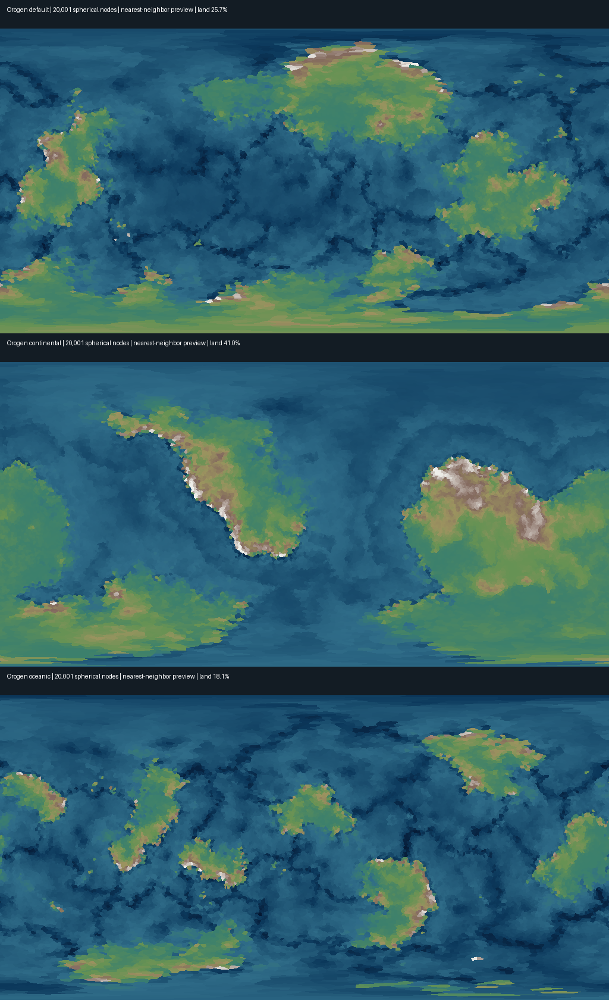

# Étude des générateurs locaux pour le bootstrap du terrain

Date : 7 octobre 2026. Étude de code et essais CPU, sans entraînement ni inférence GPU.
Le dépôt `city_generator` est exclu : aucun fichier ni procédé de ce dépôt n'a été étudié ou repris.

## Résultat exploitable

Orogen fournit un vrai modèle de continents sur sphère, des champs tectoniques et des formes de relief différentes selon le contexte géologique. Son cœur JavaScript s'exécute directement dans Node, sans interface ni GPU. Un essai des passes de terrain du worker, sur 20 001 régions, prend environ 0,4–0,8 seconde par monde sur cette machine, hors climat et rasterisation. Il peut donc produire un parent grossier avant InfiniteDiffusion. Il ne constitue pas une carte infinie plane : il faut définir explicitement la projection, l'échelle en mètres et les raccords.

`map_denoise` n'apporte pas un autre initialiseur global déjà terminé. Son globe conserve les continents et l'hydrologie de `world-builder-rs` et remplace le terrain local par les hauteurs complètes du NN. Sa carte plane utilise la hiérarchie originale InfiniteDiffusion et ses entrées procédurales. La demande de génération initiale principale par NN y reste ouverte dans `Bugs.md` et `Roadmap.md`.

Pour le redémarrage, la séparation utile est donc : générateur de structure de monde vérifié → cinq champs physiques → hiérarchie NN d'origine → rendu et conservation des niveaux. Une densité d'échantillons plus élevée ne transforme pas un graphe global de 20K régions en relief appris à 30 m.

## Dépôts, mises à jour et provenance

| Projet | Révision étudiée | État et action |
|---|---|---|
| `planet_heightmap_generation` / Orogen | `cc2662b4edd52231c4f65d8765f3ef12cd82d9b7` | Copie locale propre. `git pull --ff-only` réussi depuis `c69a1127eabb24e80329b3b1bd7cec5d8fde8ceb`. Restée propre après les essais. |
| `world_builder` | pas de commit HEAD | Dépôt local sans distant, nombreux fichiers ajoutés à l'index et modifications locales. Lecture seulement. |
| `map_denoise` | `5d3182246cddeb93870b9ec5fec9481738c22e15` | Clone neuf dans `research_projects/map_denoise`. Le lien public HTTP retourne 404, mais les credentials Git locaux autorisent le clone. |
| `FantasyMapGenerator` C++ | `8539eab56b188b4b546b9ab00ca04fded82e9a56` | Copie historique sale conservée. Clone indépendant récent dans `research_projects/fantasy_cpp`; même révision. |
| `IslandGenerator` | `c8ea1e139389a7fa3246374b3ef42e7672e74ef7` | Images historiques modifiées conservées. Clone indépendant dans `research_projects/island_generator`; même révision. |
| `FastNoise2` | `8176c3f9d8b631e6c998ed98a40bfbb1d0338a73` | Copie historique avec fichiers de build conservée, ancien HEAD `5cf59e15c8dcdf1aced99973c44bab0d8e674bcd`. Clone indépendant récent dans `research_projects/fastnoise2`. |
| Azgaar `Fantasy-Map-Generator` | `354eeaa7a6aa6e0e57abb8e2f5af5e62cef8aab4` | Copie historique modifiée conservée, ancien HEAD `5ca3ac44a4f249f5782f7299f65ca767e71da36e`. Clone indépendant récent dans `research_projects/azgaar`. |
| `TerrainGeneration-master` | archive locale, pas de Git | Lecture du README et architecture ; démonstrateur FastNoise sur grille finie. |

Les `AGENTS.md` applicables ont été recherchés avant mutation. Celui de `map_denoise` a été lu, ainsi que ses fichiers de suivi. Celui d'Azgaar et `CONTEXT.md` ont été lus. Aucun reset, stash, ni écrasement des copies historiques. `world-builder-rs` est traité séparément par l'autre étude et n'a pas été modifié ici. `_tmp` ne contient pas de projet de relief identifié. Le clone des outils de bruit n'a pas installé leurs sous-modules graphiques.

## Orogen : structure initiale réelle

Sources : `planet_heightmap_generation/js/coarse-plates.js`, `plates.js`, `ocean-land.js`, `super-plates.js`, `plate-physics.js`, `elevation.js`, `terrain-post.js`, `color-map.js`, `planet-worker.js`.

### Géométrie stable

`generateCoarsePlates(seed, numPlates, numContinents, continentSizeVariety, landCoverage)` construit une sphère Fibonacci jitterée sur un nombre fixe `N_COARSE=20000`, calcule la triangulation stéréographique et la fermeture polaire, puis produit plaques et terre/mer. Son RNG indépendant utilise `seed+137`. Les formes macro ne dépendent donc pas du nombre de régions du rendu.

`projectCoarsePlates(...)` perturbe les directions de la sphère par FBM 3D multi-octave, les renormalise et cherche la région grossière voisine. La recherche utilise une marche sur l'adjacence, amorcée par la dernière région trouvée, avec recherche exhaustive si le plafond est atteint. Il s'agit d'une attribution de plaques, pas d'une interpolation d'altitude. Les frontières projetées sont ensuite lissées et leurs fragments reconnectés.

### Plaques et continents

`generatePlates` distribue les semences par plus grande distance, avec un choix aléatoire parmi les trois meilleures. Les plaques croissent en alternance avec vitesse et direction préférées, gouverneur d'aire, pénalité de compacité, lissage et réparation de fragments. Ce procédé donne des régions connectées et ne superpose pas simplement des disques de bruit.

`assignOceanLand` opère sur le graphe des plaques :

1. Il calcule aire en nombre de régions, centroïde 3D, voisinage, périmètre et compacité de chaque plaque.
2. Il choisit des semences de continents éloignées, parmi les trois meilleurs scores. Le score combine distance minimale aux semences existantes, préférence pour les petites plaques et compacité.
3. Si les semences dépassent déjà le budget terrestre, il retire les plus grandes, en conservant au moins une semence.
4. Chaque continent reçoit un budget. À variété nulle ils sont égaux ; sinon des poids `exp((u-0.5)*variety*2.5)` créent des tailles inégales.
5. Une croissance en alternance ajoute uniquement une plaque touchant le continent courant sans toucher un autre continent. Le score préfère plusieurs voisins du même continent et une forme compacte. La croissance vise 90 % du budget global et peut s'arrêter faute de candidat.
6. Il conserve le plus grand composant océanique et absorbe certains petits océans enfermés par un seul continent, sous un plafond de 110 % du budget terrestre.

Conséquence mesurée : `landCoverage` est une cible de croissance discrète et ne garantit pas un pourcentage terrestre exact. Avec peu de grandes plaques, la contrainte de séparation peut provoquer un déficit important. Le nombre demandé de continents n'est pas un nombre garanti de composants de la carte finale.

Un seul continent favorise une grande masse de type supercontinent. Beaucoup de semences, beaucoup de plaques et peu de terre favorisent des masses dispersées. Il n'existe pas de classe explicite « Gondwana » ou « archipel » dans cette fonction. Les archipels volcaniques supplémentaires viennent des arcs et hotspots de l'étape d'altitude, pas seulement du compte de continents. Ces réglages restent à distinguer d'un contrat de morphologie mesuré.

### Altitudes et variété morphologique

`assignElevation(...)` est divisé en 13 étapes : état tectonique ; champs de distances ; classification ; squelette ; crêtes phasor ; édifices ; bruit de bandes tectoniques ; texture liée à l'altitude ; détail côtier ; bruit terrestre de fond ; topographie dynamique ; compression/isostasie/hypsométrie ; réparation de topologie.

La classification publie `foldBeltWeight`, `cratonWeight`, `basinWeight`, `noiseAmp` et `tecActivity`. Les cratons et bassins peuvent amortir le détail tandis que `orogenicPower` règle son amplitude. Le snapshot `debugLayers.skeleton` donne un intermédiaire déjà structuré avant bruit de texture. `applyPhasorRidges` utilise des kernels orientés par les contraintes géologiques ; les arcs, stratovolcans, hotspots et grands plateaux basaltiques sont des formes construites avant leur texturage. Le squelette et ces champs sont de meilleures entrées à comparer qu'une seule distribution globale d'altitude.

`runPostProcessing` dans le worker exécute warp, masque océan, lissage, deux couches de petit détail, érosion glaciaire/hydraulique/thermique, accentuation des crêtes, puis creep. Les passes glaciaires utilisent latitude/altitude ; l'érosion hydraulique traite drainage et dépressions via priority flood/carving. Ces passes ont un voisinage global sur le graphe, donc leur découpage naïf en tuiles indépendantes changerait les résultats.

La conversion physique doit reprendre `elevToHeightKm` : pour `e<=0`, `height_km=10e`; pour la terre, `t=min(e,1)` et `height_km=6t^4(5-4t)`. Les valeurs internes ne sont ni des mètres ni une altitude linéaire. L'approximation `30t^4` apparaît seulement comme amorce de l'inversion numérique à faible hauteur.

### Export CPU effectivement exécuté

Le programme [probe.mjs](../research_projects/orogen_probe/probe.mjs) importe les modules originaux sans les modifier et reconstruit les passes de terrain du worker. Il utilise `delaunator@5.0.1`, version du worker upstream, et omet volontairement le climat. Le programme [rasterize.py](../research_projects/orogen_probe/rasterize.py) conserve les hauteurs float32 et produit un aperçu équirectangulaire par voisinage sphérique le plus proche. Cet aperçu sert à juger les grandes formes ; ses facettes ne constituent pas un problème NN ni un interpolation de production validée.

| Cas | Paramètres | Terre sur les nœuds quasi uniformes | Min / max | CPU du terrain |
|---|---|---:|---:|---:|
| default | seed 42, 80 plaques, 4 continents, cible 30 % | 25,75 % | −8894 / 5986 m | 0,77 s |
| continental | seed 100, 8 plaques, 2 continents, cible 60 % | 41,04 % | −6808 / 6000 m | 0,62 s |
| oceanic | seed 314, 100 plaques, 8 continents, cible 20 % | 18,07 % | −8821 / 5993 m | 0,61 s |



Les trois champs ont été calculés deux fois, avec versions Delaunator 5.1.0 puis 5.0.1 ; statistiques et hauteurs sont identiques dans cet essai. Les SHA256 des champs float32 figurent dans `raster-report.json`. Les fichiers `.npy` contiennent des altitudes en mètres, sans image 8 bits utilisée comme source.

Un lot supplémentaire a généré 36 mondes : 12 seeds `13+97i`, trois groupes de paramètres, 20 001 nœuds, mêmes passes, aucune inférence NN. Toutes les valeurs sont finies. Les composants sont mesurés sur l'adjacence sphérique, donc sans erreur de découpe au méridien ou au pôle. Un « grand composant » représente au moins 100 nœuds et n'est qu'un seuil de cette étude.

| Groupe | Intervalle terrestre mesuré | Grands composants | CPU médian |
|---|---:|---:|---:|
| default, cible 30 % / 4 continents | 25,56–27,30 % | 3–4 | 0,50 s |
| continental, cible 60 % / 2 continents / 8 plaques | 23,82–52,64 % | 1–3 | 0,41 s |
| oceanic, cible 20 % / 8 continents | 16,66–18,86 % | 8–10 | 0,38 s |

Les 36 mesures complètes sont dans [batch-report.json](../research_projects/orogen_probe/batch-report.json). Le pourcentage d'une image équirectangulaire sans pondération cos(latitude) diffère de la fraction des nœuds quasi uniformes et ne doit pas servir à qualifier la couverture planétaire.

## `world_builder` : code étudié et limites

Le `GlobalGraph` Rust de `crates/world-builder-graph/src/graph.rs` enchaîne sphère Fibonacci → QuickHull 3D → relaxation Lloyd → retriangulation → tectonique → priority flood → drainage → détection des rivières → Strahler et débit de base. Il encode donc une cohérence hydrologique explicite que le simple bruit ne fournit pas.

`tectonics.rs` fixe néanmoins 12 plaques et 60 % de plaques continentales. Il croît les plaques par BFS, assigne des altitudes de base par plaque, ajoute contraintes des frontières convergentes/subduction, lisse les frontières et ajoute des octaves de bruit. La fraction des plaques n'est pas une contrainte de fraction terrestre. La majorité des réglages ne sont pas des paramètres de morphologie exposés. Cette version locale est plus simple que le dernier Orogen pour les formes de continents et crêtes.

`progressive.rs` génère séparément des graphes de 2K, 20K puis 200K nœuds et remplace le snapshot global. `generate_with_params` repart de semences et de géométrie nouvelles à chaque taille ; conserver le seed ne démontre donc pas des côtes identiques entre ces générations. Le versionnement invalide les caches, mais une adoption de ce mécanisme doit mesurer le déplacement des formes macro.

`TileGenerator` dans `crates/world-builder-erosion/src/tile_generator.rs` combine racines interpolées depuis le graphe, interpolation bicubique du parent + contraintes IDW, Gabor/multiscale, érosion CPU/GPU, puis raccord des bords. `pre_warm_roots` mentionne explicitement les problèmes de première réponse non raccordée si les six racines ne sont pas préchauffées. Ceci constitue une preuve de risque d'ordre de requête à vérifier, pas une démonstration automatique de continuité.

Le sandbox `python/world_builder/static/js/sandbox/CpuHeightmapPipeline.js` a aussi été lu : initialiseur de grille carrée finie par FBM value-noise, warp, ridged noise et mélange shelf. Il ne possède pas le graphe global précédent, ni une topologie sphérique, ni un budget explicite de continents. Le fait qu'il se nomme « tectonic » ne suffit pas à qualifier ses formes à l'échelle planétaire.

## `map_denoise` : contrats réutilisables

### Initialisation et hiérarchie

`infinite_demo.sample_hierarchy` et `fast_demo.sample_fast_tile` distinguent le natif décodé à 30 m, les latents à pas 8 soit 240 m et le coarse à pas 256 soit 7680 m. L0–2 de la démo rapide sont des moyennes du natif ; les aperçus plus éloignés sont des intermédiaires appris, explicitement pas des mips conservateurs des hauteurs finales.

Le globe de `planet_diffusion.DiffusionRuntime` remplace `_conditioning_model_input` par les fenêtres physiques fournies par Rust. Il utilise six charts stéréographiques, modèle immutable partagé, seeds chart/world, stores/caches distincts et pleine hauteur NN. La méthode legacy `learned_residual` filtre et comprime à ±80 m mais n'est pas le chemin actif ; la recopier réintroduirait précisément la suppression des massifs/vallées corrigée dans ce projet.

### Cinq canaux physiques et bruit de conditionnement

Le contrat préentraîné est altitude en mètres, température en °C, écart-type de température encodé ×100, précipitation en mm, coefficient de variabilité des précipitations en %. `conditioning_tensor` vérifie la forme finie `(5,H,W)` puis transforme seulement l'altitude par `sign(h)*sqrt(abs(h))`, une fois. Les autres canaux restent dans leurs unités.

Dans `WorldPipeline._coarse_inference`, les statistiques du checkpoint sont appliquées ensuite, avec indices `[0,2,3,4,5]` des six canaux du modèle. Les valeurs par défaut dans le code local de référence sont :

```text
means sélectionnées = [-37.6791646, 18.0302933, 333.8442390, 1350.1259248, 52.4443394]
stds sélectionnées  = [ 39.6851512,  8.9403331, 322.2523855,  856.3430083, 30.9826208]
cond_snr            = [0.3, 0.1, 1.0, 0.1, 1.0]
t_cond              = atan(cond_snr)
condition           = cos(t_cond)*normalized_input + sin(t_cond)*noise
```

Le nom SNR est trompeur pour une interface : avec cette formule, diminuer cette valeur renforce l'entrée, tandis que l'augmenter ajoute davantage de bruit. Il faut conserver les valeurs du checkpoint et mesurer toute modification. Le relief d'entrée n'est pas un verrou exact des côtes par défaut.

`pretrained.load_reference` donne un exemple concret de sous-classe qui évite l'initialisation statistique Perlin lorsque les cinq canaux périodiques sont explicitement fournis : `set_periodic_conditioning_imports(controls,rebuild=False)`, puis `bind()`. Les rasters périodiques répètent aussi la latitude ; ils conviennent à un plan infini périodique, pas automatiquement à une fermeture sphérique physique.

Les normalisations `temperature/40`, `log1p(P)/log(10001)`, dryness, lithologie et glace dans `conditioning.py` sont destinées aux réseaux Relief V1/Coast V1 de ce dépôt. Ces réseaux n'ont eu que de courtes étapes de référence et ne doivent pas être confondus avec les cinq canaux du checkpoint InfiniteDiffusion.

### Sauvegarde et protections réellement présentes

`RustConditioningSource.window` rejette chart/taille/step invalides, world/config/radius/seed/projection incohérents, nombre de canaux incorrect et données non finies. Il rend les tableaux cache immuables. `PlanetWorldIdentity` inclut seed uint64 sous forme décimale, révision du générateur, config originale, rayon, contrat géométrique et manifeste du modèle dans l'empreinte du cache.

`verify_checkpoint` hash config et trois sous-modèles, compare révision/SHA256/taille aux fichiers de provenance et refuse les mutations pendant le chargement. Le worker refuse les sorties non finies ou dépassant 20 km en valeur absolue. Ces vérifications rejettent un contrat invalide ; elles ne le masquent pas par clipping. Les anciennes compressions/clips de résidu ne doivent pas être réintroduites comme « protection » générale des altitudes.

## Autres générateurs inspectés

Azgaar récent a migré en TypeScript : `src/generators/heightmap-generator.ts` et `src/data/heightmap-templates.ts`. Son moteur construit une grille Voronoi finie et exécute des scripts Hill/Pit/Range/Trough/Strait/Mask/Invert/Add/Multiply/Smooth. Ses recettes de continents et archipels donnent une bonne démonstration d'art direction, mais l'altitude est un `Uint8Array` de 0–100 et le seuil terrestre vaut 20. Le code dépend encore du contexte du graph et des utilitaires globaux ; ce n'est pas une bibliothèque physique infinie prête à brancher au NN. Les scripts expliquent une morphologie mais ne prouvent ni métrique en mètres, ni conservation LOD.

Le C++ `FantasyMapGenerator` utilise Poisson disc → Delaunay → Voronoi, des kernels de collines/cones/pentes, remplit les dépressions et calcule une érosion proportionnelle à `sqrt(flux)*slope + slope²`, limitée puis normalisée. Il produit un terrain régional fini destiné au dessin. Sa sortie cartographique n'est pas une hauteur globe prête pour le conditionnement ; son drainage reste une référence utile de cohérence.

`IslandGenerator/main.py` transforme du simplex FBM warpé par une enveloppe d'île et un seuil de Julia dépendant du bruit. `noise_sharpness`, fréquence, nombre de warpings et constantes complexes modifient son allure. Le masque force une île sur une image finie ; il ne résout pas plusieurs continents ni une topologie globale. La sortie historique 8 bits ne doit pas être réimportée comme altitude physique. Pas d'intégration recommandée sans étude quantitative et conversion d'unités.

FastNoise2 récent fournit un graphe SIMD C++17 fusionné avec FBM/ridged, opérateurs, remap/terrace et domain warp ; dimensions 2D–4D et support de bruit 2D tiled. Il accélère le calcul scalaire des champs, mais n'invente pas à lui seul le placement des continents, le drainage ou les règles de morphologie. Ce n'est pas une solution de bootstrap complète.

`TerrainGeneration-master` expose taille de grille, pas, fréquence, type de bruit, seed, magnitude et octaves. Son mode île applique une modification des bords sur une grille finie. Aucun mécanisme de continents ou de raffinement hiérarchique n'a été identifié dans le parcours décrit.

## Vérifications à transférer au bootstrap retenu

- Générer plusieurs seeds par style et mesurer couverture, composants terrestres périodiques/sphériques, plus grande masse, distribution d'altitude et couverture des grandes pentes.
- Comparer les formes macro à plusieurs résolutions à coordonnées fixes. Une même seed ne suffit pas si le graphe est régénéré différemment.
- Exporter les cinq champs en float32 et vérifier unités, signe terre/mer, absence de NaN, transposition des axes, métrique et normalisation exactement une fois.
- Tester côte/raccord/pôle sur les valeurs physiques et pas seulement sur une image colorée.
- Après autorisation GPU, comparer des fenêtres NN à différents SNR dans plusieurs contextes : plaine, massif, plateau, côte et mer. Quantifier déplacement des côtes et relief avant tout réglage d'amplitude.
- Conserver le générateur et le NN identifiés séparément dans les exports et caches. Un aperçu grossier appris ne doit pas être nommé moyenne conservatrice du natif.

Les essais CPU exécutés établissent la faisabilité du parent Orogen et ses limites de contrôle ; ils ne valident pas la qualité NN, des détails à 30 m ou le style choisi pour l'application finale.
